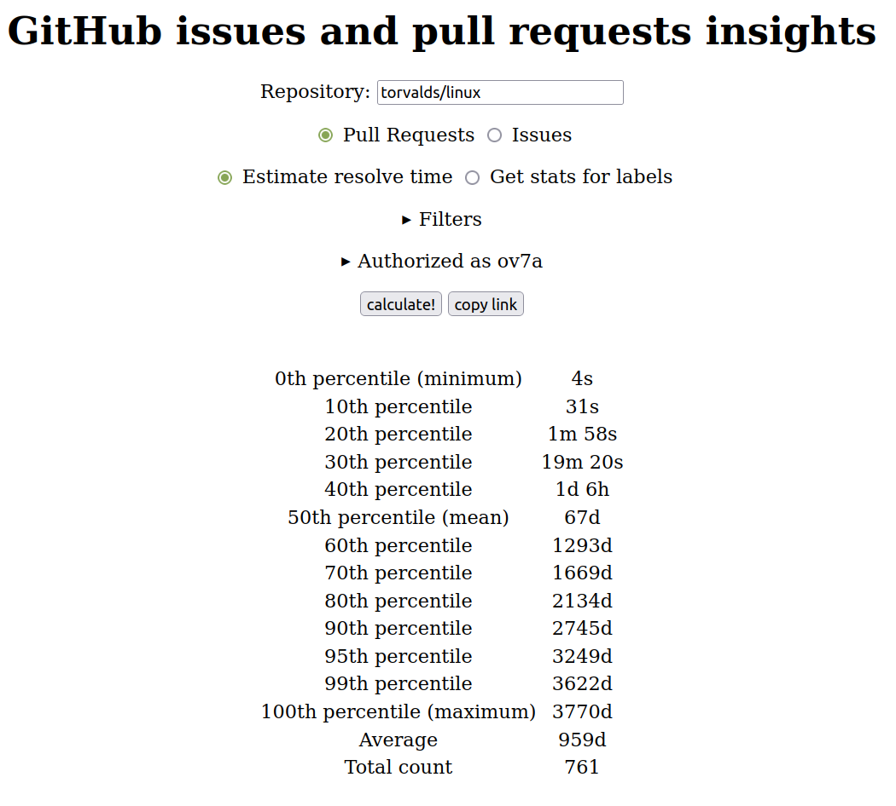
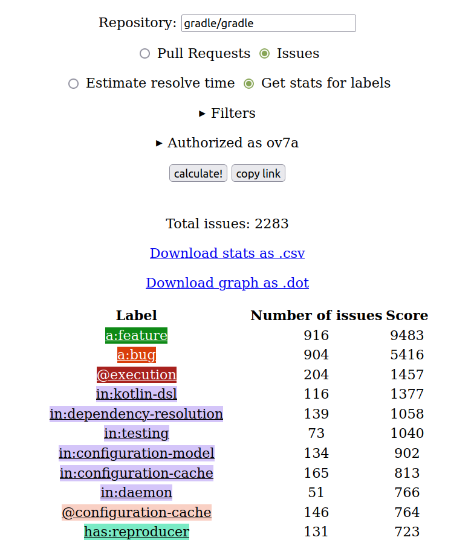

# GitHub pull requests and issues stats

This repo allows you to:

1. Calculate resolution time for pull requests and issues:
   average, mean, max, min, etc. durations between creation time and closing time.
2. Get label stats and labels graph.

Build it with `build` gradle task.

[Demo](https://ov7a.github.io/github_insights)

Sample outputs:

